# 一、Git客户端下载

官网下载地址：https://git-scm.com/downloads/

或者从内部服务器的安装包中寻找：Git-2.21.0-64-bit.exe

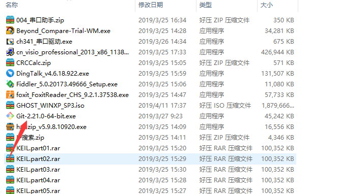

# 二、Git客户端安装过程

1.双击安装程序“Git-2.21.0-64-bit.exe”，显示截图如下： 

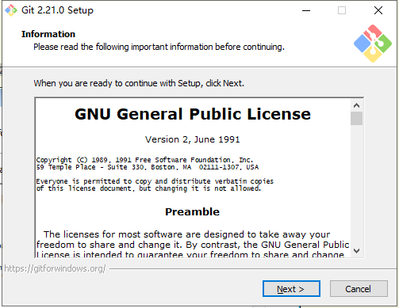

2.点击“Next”，显示截图如下： 

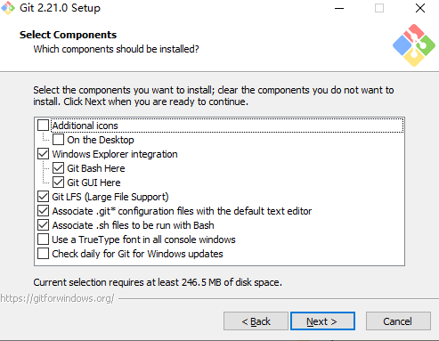

说明：

（1）图标组件(Addition icons) : 选择是否创建桌面快捷方式。

（2）桌面浏览(Windows Explorer integration) : 浏览源码的方法，使用bash 或者 使用Git GUI工具。

（3） 大文件支持（Git LFS）：是否支持大文件，此项必选。

（4）关联配置文件 : 是否关联 git 配置文件, 该配置文件主要显示文本编辑器的样式。

（5）关联shell脚本文件 : 是否关联Bash命令行执行的脚本文件。

（6）使用TrueType编码 : 在命令行中是否使用TruthType编码, 该编码是微软和苹果公司制定的通用编码。

3.选择完之后，点击“Next”，显示截图如下： 

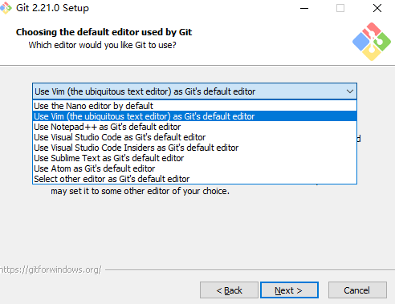

选择git默认编辑器。

4.点击“Next”，显示截图如下： 

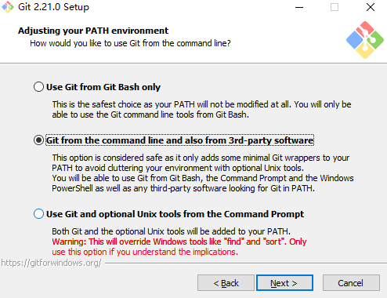

选择使用什么样的命令行工具。

5.选择之后，继续点击“Next”，显示如下： 

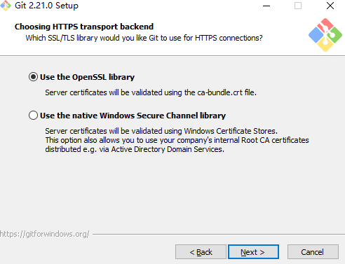

6.选择之后，继续点击“Next”，显示如下： 

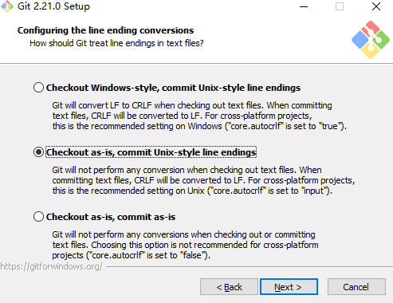

选择提交的时候换行格式

（1）检查出windows格式转换为unix格式：将windows格式的换行转为unix格式的换行再进行提交。

（2）检查出原来格式转为unix格式：不管什么格式的，一律转为unix格式的换行再进行提交。

（3）不进行格式转换 : 不进行转换，检查出什么，就提交什么。

7.选择之后，点击“Next”，显示截图如下： 

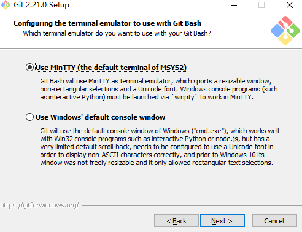

8.选择之后，点击“Next”，显示截图如下： 

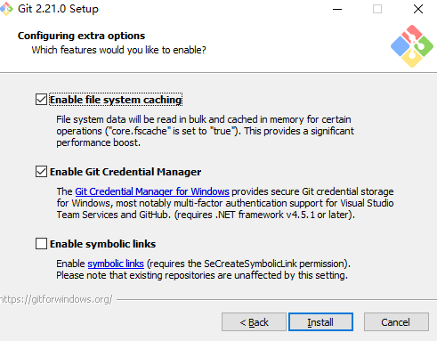

9.选择之后，点击“Install”，开始安装，截图显示如下： 

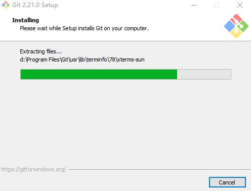

10.安装完成之后，显示截图如下： 

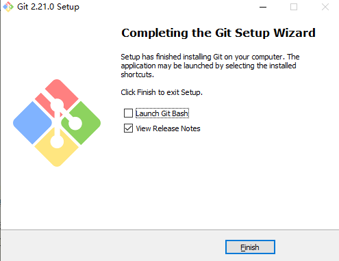

安装结束。

# 三、git-lfs客户端下载

官网链接：https://git-lfs.github.com/

或者内部服务器中的 git-lfs-windows-v2.7.1.exe。如下图所示：

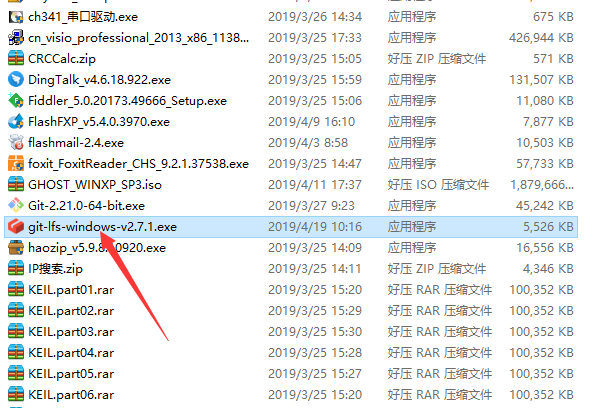

# 四、git-lfs客户端安装

1、双击git-lfs-windows-v2.7.1.exe，如下图：

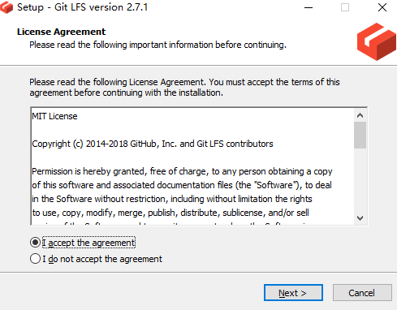

2、点击next，选择安装路径，如下图：

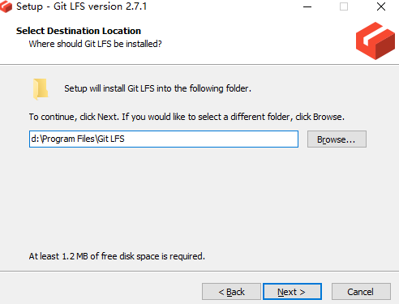

3、点击next，即可开始安装，安装完成之后，如下图所示：

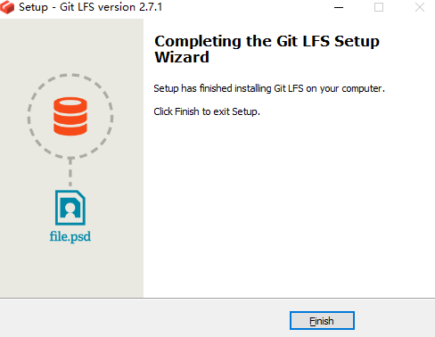

4、若是linux用户，可以使用相应包管理工具在线安装。如：
apt-get install git-lfs

# 五、git配置

1、首先，进入git的bash操作终端。在windows资源管理器的空白处右键，如下图所示：

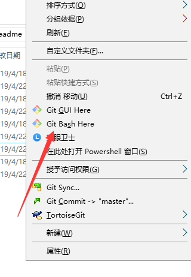

2、设置用户名和邮箱。输入如下两条指令：

git config --global user.name "你的用户名" 

git config --global user.email 你的邮箱

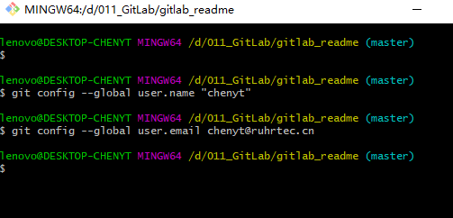

3、设置凭证，如果使用http链接，则只需第一次输入密码。

git config --global credential.helper store

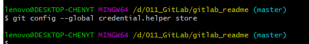

4、设置ssh端口可变，否则只能使用默认端口。

git config --global ssh.variant ssh

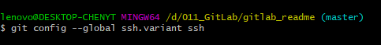

5、忽略文件模式的更改

git config --global --add core.filemode false

6、初始化大文件模式。

git lfs install

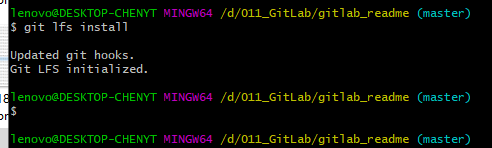

7、生成秘钥对。

ssh-keygen -t rsa -C "你的邮箱" 

输入指令后，一直回车，知道最后在默认文件夹中生成公钥私钥。

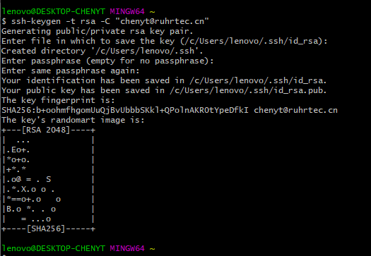

如上图所示，秘钥生成完毕。输入以下命令打印公钥（**具体路径需要视情况而定，如下图所示箭头**）：

cat /c/Users/lenovo/.ssh/id_rsa.pub

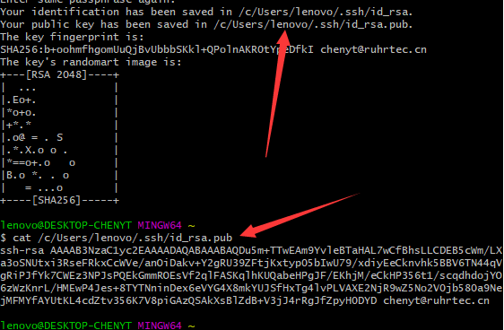

图中所示，在默认目录中，id_rsa为私钥，id_rsa.pub为公钥。上述打印的**公钥，从ssh-rsa开头，直到最后邮箱结尾，复制保存到文本文件中，留待以后输入gitlab或者github或者其他平台。私钥保留在默认目录即可。**

# 六、相关资料

git基本操作：http://www.runoob.com/git/git-basic-operations.html