# 一、软件下载

tortoisegit下载地址：https://tortoisegit.org/

或者内部服务器寻找安装包（也可直接去官网下载最新版本）：

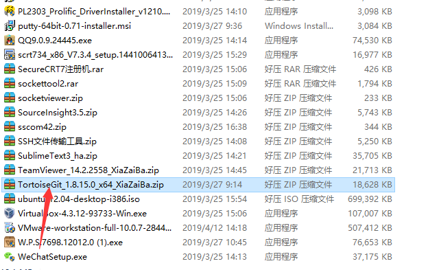

# 二、软件安装

1、双击TortoiseGit-1.8.15.0-64bit.msi，开始安装，如下图所示：

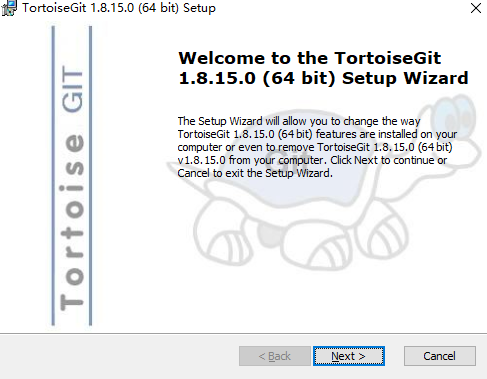

2、点击next，如下图所示：

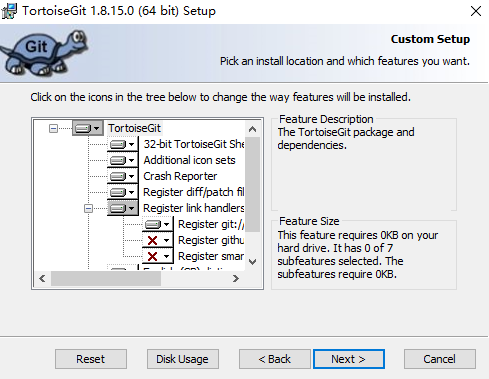

3、一直下一步，然后开始安装。

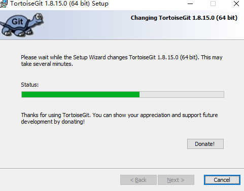

4、安装成功。

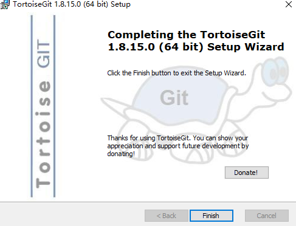

# 三、软件配置

(若在《git客户端安装》中已经配置完毕，这边只需验证即可。)

1、安装完成之后，用鼠标在资源管理器空白处右键，即可看到菜单。如下图所示：

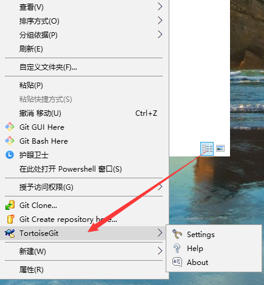

2、在上图中，点击Setting，设置一些必要参数，如下图所示：

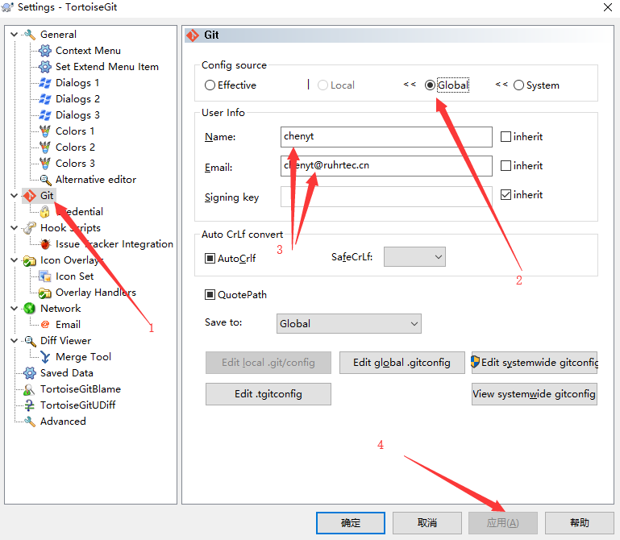

3、点击应用之后，继续编辑配置文件，如下图：

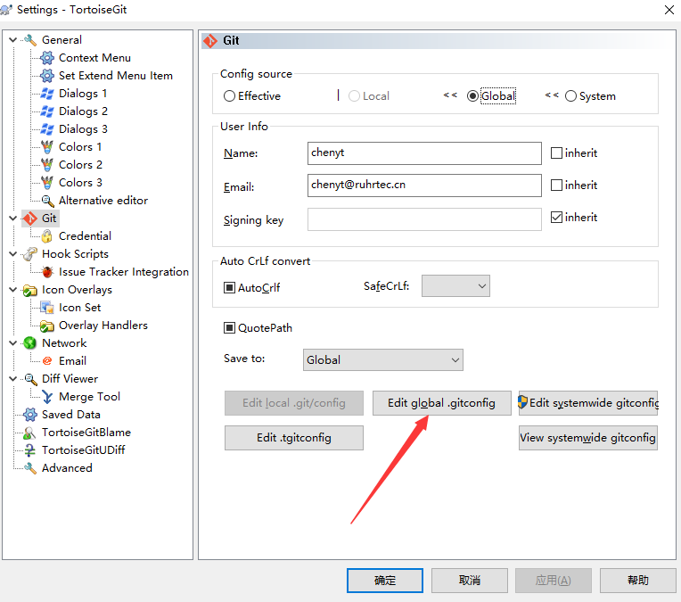

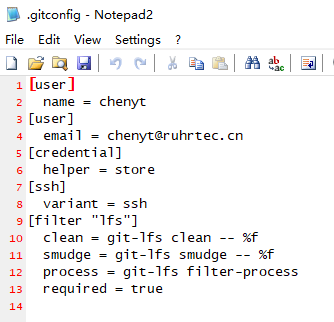

如果只是刚安装，配置可能只有刚刚保存的两个【user】，将如下信息复制进去，确保跟上图配置一直，然后保存文件。

[credential]

​	helper = store

[ssh]

​	variant = ssh

[filter "lfs"]

​	clean = git-lfs clean -- %f

​	smudge = git-lfs smudge -- %f

​	process = git-lfs filter-process

​	required = true

# 四、秘钥对生成

1、打开秘钥对生成工具，如下图所示：

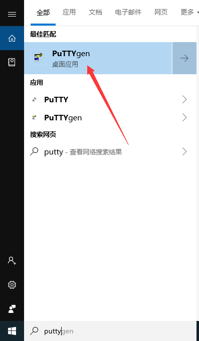

2、选择rsa算法，2048位，点击Generate开始生成，然后鼠标在空白区域内随意移动。鼠标不移动，进度条不会动。

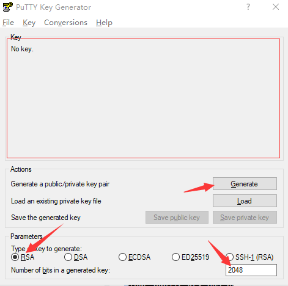

3、生成完毕之后，如下图所示，框内为公钥，需从ssh-rsa开头，复制到结尾 rsa-key-20190422。公钥可以保存到文本文件，以后复制到gitlab或者github或者其他平台之上。

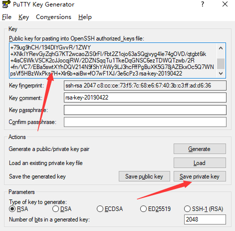

4、保存完毕公钥之后，点击图上的Save private key，保存私钥。私钥保存到不易丢失切不易遗忘的地方，以后公钥私钥需配对使用。

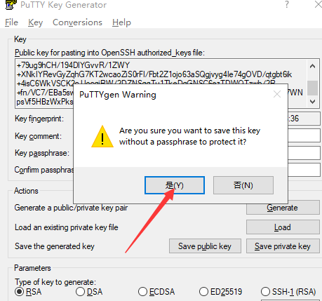

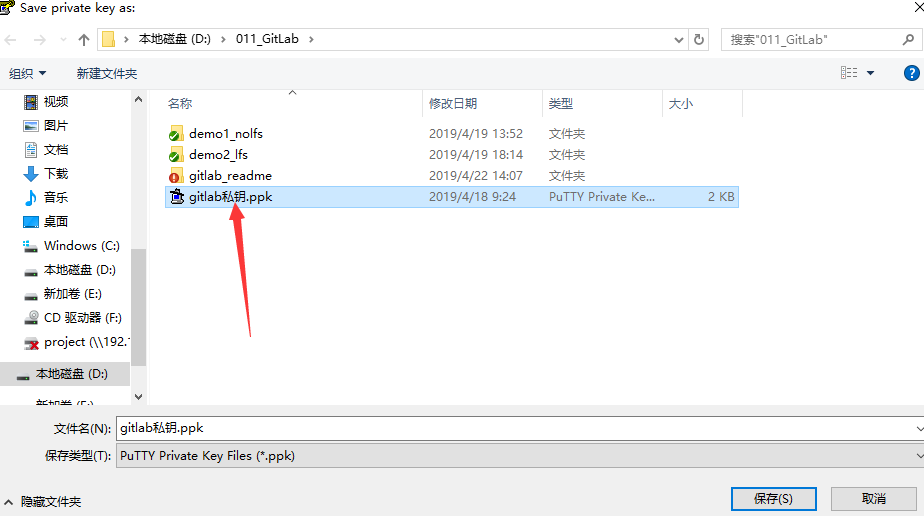

# 五、升级和汉化

1、右击鼠标，出现菜单，选中About。

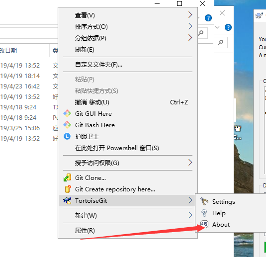

2、选择更新。

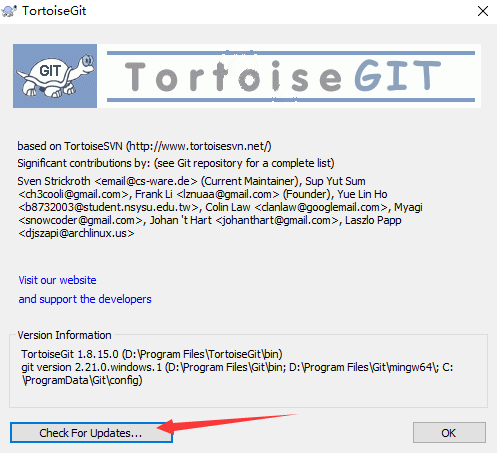

3、选择前两个安装包，然后点击Download.就会开始下载最新版本以及汉化包。

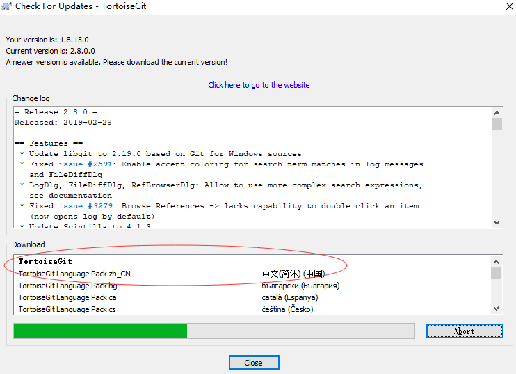

4、下载完成之后，点击安装。

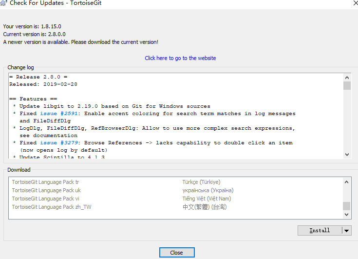

5、安装完成之后，即可打开设置选项：

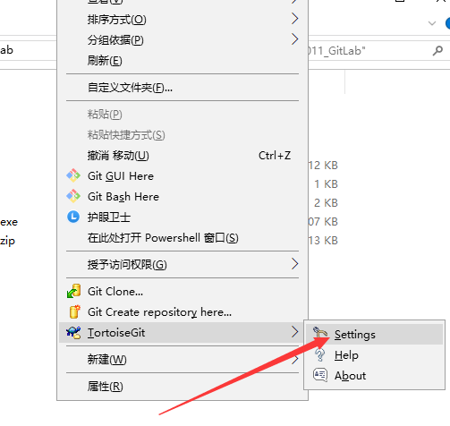

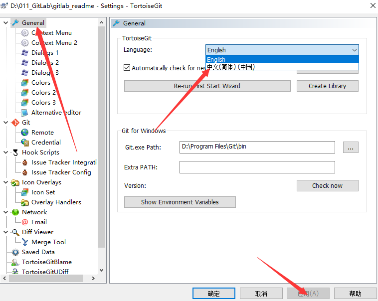

6、若是右键菜单还无法汉化，重启系统即可。

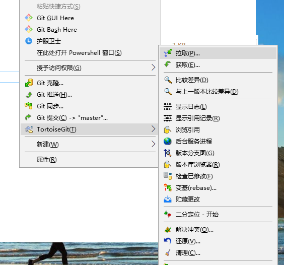

