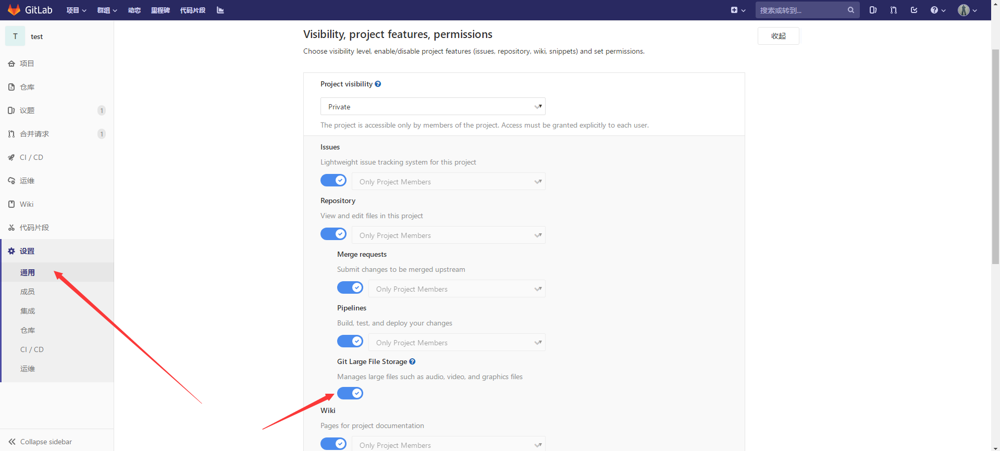

# Gitlab使用说明

### 一、进入主页并申请账号

1、命令行控制需完整配置完《git客户端安装.md》。windows窗口操作，需完整配置完《git客户端安装.md》以及《tortoisegit安装.md》。

2、打开gitlab地址 http://192.168.64.10/  （具体地址可能会变化，以实际地址为准）。如下图所示，申请账号。

3、账号申请完毕之后，从左边的选项卡 Sign in中输入账号密码进入首页。如下图所示：

### 二、选择对应语言

如下图所示，设置完毕之后刷新页面。

### 三、添加ssh公钥

在页面添加ssh公钥，公钥可通过命令行或者工具生成，具体参考《git客户端安装.md》或者《tortoisegit安装.md》。公钥与私钥需要配对使用。**若使用命令行操作，则需要添加命令行方式生成的公钥。若使用tortoise工具操作，需要添加秘钥生成工具生成的公钥。**

### 四、查看项目

1、在菜单中选中项目，下拉菜单“您的项目”，显示当前参与的项目。星标项目显示已收藏的项目。浏览项目可以浏览别人的公共项目。

2、浏览公共项目如下图所示，选中项目，浏览项目，点击全部。

3、选中项目详情，然后点击克隆，可以查看项目地址。一般下载使用ssh地址，如下图所示：

### 五、项目下载到本地

##### 1、使用git命令行下载

1）确保命令行所生成的ssh公钥已添加至gitlab。

2）在windows资源管理器右键，选择git bash

3)输入命令 git clone ssh地址

4)期间如果需要输入，则按照提示，输入yes。下载完毕之后，如下图所示：

##### 2、使用图形化工具下载

1）确保之前使用图形化工具生成的ssh公钥已添加至gitlab。

2）在windows资源管理器空白处右击，选择Git Clone。

3)输入ssh地址，私钥地址。点击ok。

4)下载完成如下图所示：

# 六、Gitlab中项目基本操作

##### 1、新建项目

1）、进入gitlab项目首页，选择New project。

2）、在新建项目中，填入项目名称，项目标识符以及简介。访问等级如图所示，有私有，内部，公开三个等级。可根据具体情况选择。最后选择是否用README.md文件初始化项目，若打钩，则项目初始化时会有README.md文件生成。

##### 2、添加成员

1）打开gitlab首页，项目，您的项目，选择对应的项目，进入项目详情。

2）进入项目详情页面，点击设置，成员。即可选择对应要添加的成员，以及添加的权限。

##### 3、新建分支

1）进入相应项目详情页，在分支框右方下拉菜单中，选择新建分支。

2）输入分支名称，以及分支起点。分支刚新建时，分支代码和分支起点代码一样。

3）如下图所示，即可拥有两个分支。各个分支内容互不影响，git内部会以补丁形式存储差异化内容。

4）下载仓库时，会下载所有分支的内容，默认一般是主分支。但可以通过 CheckOut检出到对应的分支。这部分内容会在其他章节详述。

##### 4、议题

1）议题可用于项目缺陷管理，记录项目开发过程中的一些缺陷，想法，和任务以及里程碑等等。进入项目详情页，打开议题，如下图所示：

2）输入标题，其中标题建议以格式 年月日+问题序号 ，比如2019年4月24日发现的第二个问题，标题格式为 20190424002-问题简述 。然后输入问题详情，提交。

3）查询议题列表。

4）其他人可就该项目议题进行评论，如问题解决，可以关闭议题。

##### 5、分支

1）当一个项目中有不同的分支时，可以查看分支比较。

2）若分支代码已经稳定，可以向主分支提交合并请求。

3）提交请求之后，需要选择要合并的分支（源分支）以及需要合并到的分支（目标分支）

4）填写完相对应的注释以后，选择提交。具体流程视项目具体权限而定。

##### 6、设置大文件支持

1）若项目中有一些比较大的文件，或者其他类型的二进制文件，比如非常大的二进制程序，或者非常大的word文档等资料，需要保证该项目支持大文件存储。一般来讲是默认开启。

2）打开项目设置，通用，展开Visibility, project features, permissions选项，打开Git Large File Strorage。

##### 7、删除项目

1）进入项目详情页，设置，通用，展开Advanced

2）下拉到底，选择Remove project

