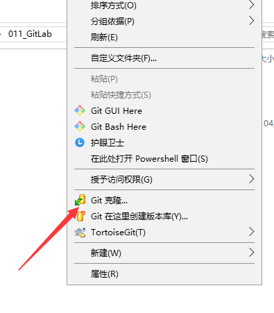
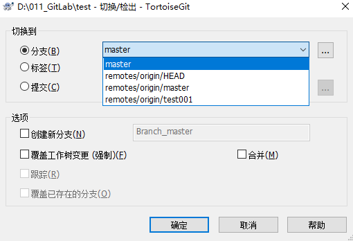
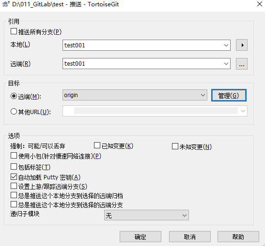

# 一、使用TortoiseGit工具操作本地仓库

本章中涉及到关于gitlab的操作，可以查看《Gitlab使用说明.md》

##### 1、克隆远程仓库到本地

1）在将要克隆的目录下右键，选择git克隆。

2）进入gitlab详情页面，复制ssh地址。

3）将复制到的地址，输入git克隆界面。选择之前生成的秘钥。这里要确保与之匹配的公钥已经添加到gitlab中。

4）点击确定之后，远程仓库即可克隆到本地。接下来针对该项目的操作，就需要进入test目录里进行。

##### 2、切换分支

1）进入该目录之后，空白处右键 ，如下图所示：

上图可以看到，默认是提交到master，证明当前分支默认为master分支。

2）选择 切换/检出。然后选择要切换的分支。

这里我们选择test001分支，如果本地仓库没有这个分支，就会默认让你新建一个分支来对应。然后点击确定。

3）切换完毕之后如下图所示：

4）再次打开README.md文件，即可看到test001分支下的内容。

##### 3、上传项目

1）打开文件，更改文件内容。然后保存。

2）<u>若需要上传大文件，则在大文件第一次上传之前，需要完成第3）步到第5）步。</u>

3）首先进入gitbash界面，输入    git lfs track "*.zip"

4）即可生成大文件专属的配置文件   **.gitattributes**  文件内容如下：

5）该配置表明对所有.zip格式的文件当做大文件处理。或者也可以手动创建  **.gitattributes** 文件到项目所在目录的根目录，然后文件内增加内容  ***.zip filter=lfs diff=lfs merge=lfs -text** 即可达到一样的效果。

6）该示例中，我们将 VirtualBox-4.3.12-93733-Win.exe 软件安装包压缩为 001.zip，放入项目中。

7）在该项目的文件夹中右键，选择提交到test 001分支。

8）填写日志信息，一般填写此次提交的简介，更改内容等等。设置提交作者和日期。勾选要提交上去的文件。然后选择提交。

9）提交完成之后，如下图所示。需要注意的是，提交只是提交到了本地仓库，远程仓库并没有此次更新内容。所以需要再次点击推送按钮。

10）确认要推送的本地分支以及远端分支，点击确定。

11）推送成功后，如下图所示：

12）然后打开gitlab界面，即可看到新上传的文件以及注释。同时也可以点击历史按钮在页面查看提交记录。并且可以看到，我们上传的001.zip文件后有LFS标识，标识被确认为大文件存储模式。

13）同时，项目详情页面可以看到，此时项目大小为101.9M。

14）在本地将 VirtualBox-4.3.12-93733-Win.exe 安装包和另一个其他文件重新压缩成001.zip。将001.zip覆盖到项目文件夹中。然后我们按照之前的步骤，再次提交该文件。并推送到gitlab。

15）在gitlab中可以看到提交历史记录

16）然后项目详情页面中可以看到，此次项目大小仍未101.0M。若不按照大文件模式上传，两次上传项目大小就会变成200M左右。

17）关于提交和推送，可以在提交界面选择一步完成，如下图所示：

18）关于大文件的更多内容，可以查看详细资料（git-lfs插件的使用）：https://zzz.buzz/zh/2016/04/19/the-guide-to-git-lfs/

##### 4、回退版本

1）首先查看最新版本文件内容：

2）在项目中右键，选择显示日志（Show log）

3）即可看到该分支的所有提交记录。

4）如果想回退到之前的版本，选择该版本的日志，下方即可看到该版本所修改的文件。然后选中想要还远的文件，或者直接全选，鼠标右键选择“还原到此版本”(Revert to this revision)。如下图所示：

5）点击确定，显示已还原到之前所选版本。

6）完成之后点击确定，然后查看本地文件，即可看到，文件已经返回到原先的版本。

7)该还原只是将本地仓库还原至原先版本。**若想要将gitlab远端仓库也还原至该版本，需要重新提交，推送。**